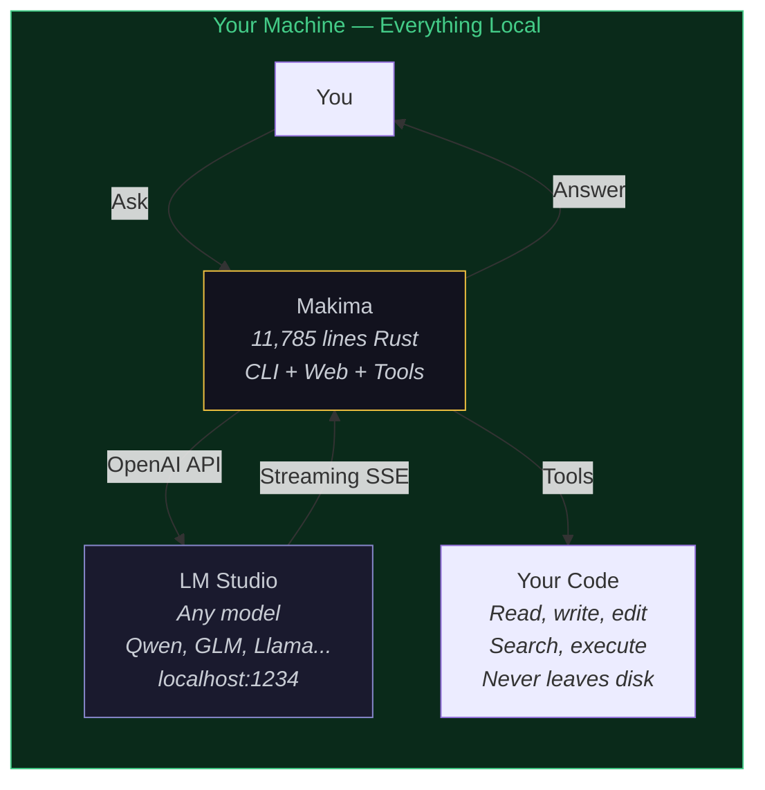
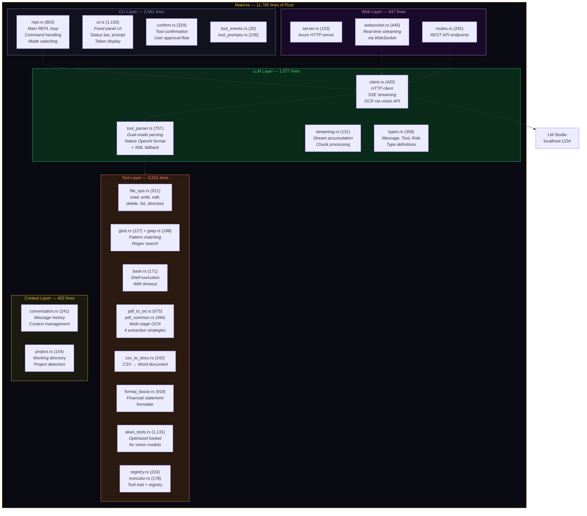
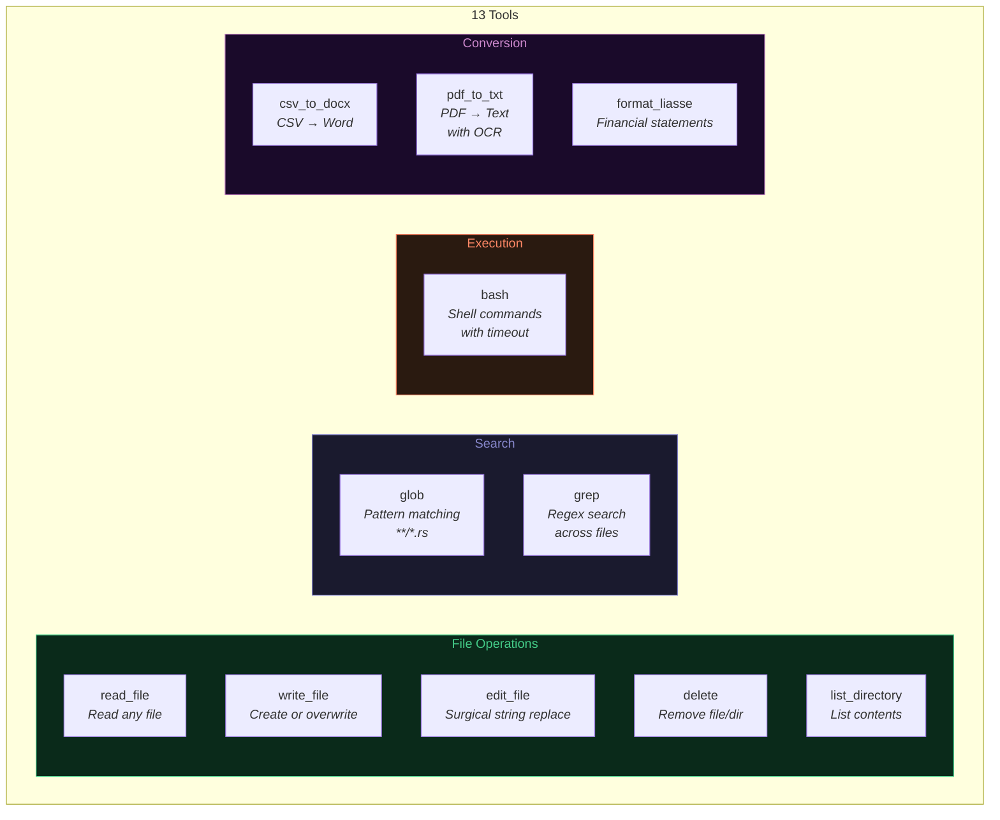
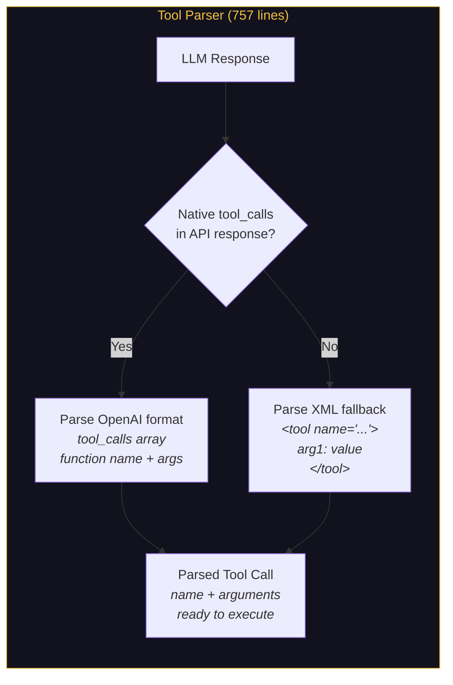
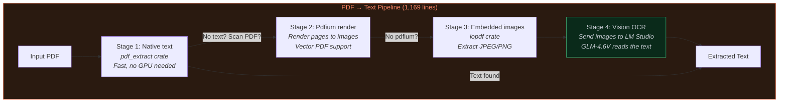
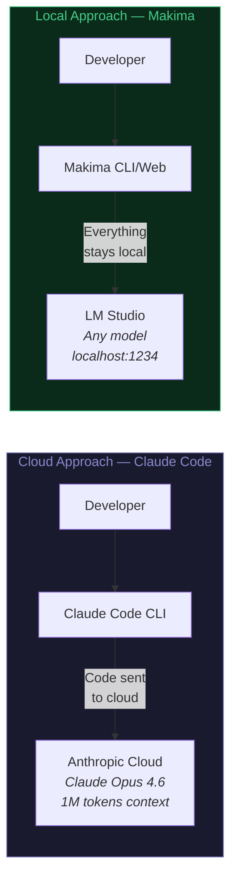

# Makima — Local Coding Assistant

> Claude Code, but local. Zero cloud. Zero subscription. Your machine, your model, your data.

A complete coding assistant built in Rust, powered by LM Studio's local LLMs. CLI REPL + Web interface + WebSocket streaming + 13 tools + PDF OCR pipeline. **11,785 lines of Rust.** Runs entirely on your machine.

---

## Why Makima exists

Cloud AI assistants are powerful but:
- Your code leaves your machine
- You pay per token
- You depend on API availability
- You can't customize the model

Makima solves all of that by connecting to **LM Studio** running locally:



**Zero data leaves your machine. Zero tokens billed. Zero internet required.**

---

## Architecture



---

## The Tool System

13 tools, all implementing the `Tool` trait:

```rust
#[async_trait]
pub trait Tool: Send + Sync {
    fn name(&self) -> &str;
    fn description(&self) -> &str;
    fn parameters_schema(&self) -> serde_json::Value;
    async fn execute(&self, args: &ParsedToolCall) -> Result<ToolResult>;
    fn requires_confirmation(&self) -> bool { false }
}
```



### Tool confirmation

Dangerous tools (write, delete, bash) require user confirmation:

```
🔧 bash: rm -rf old_folder/
   Confirmer ? [o/N] _
```

Safe tools (read, glob, grep) execute immediately.

---

## Dual-Mode Tool Parsing

Not all local models support OpenAI's native function calling. Makima handles both:



This means Makima works with **any LM Studio model** — even those without function calling support.

---

## PDF OCR Pipeline

The `pdf_to_txt` tool has a 4-stage extraction strategy:



**The magic:** When a PDF is a scan (no embedded text), Makima renders it to images and sends them to a **vision-capable model** (like GLM-4.6V) running in LM Studio. The model reads the image and returns the text. **100% local OCR, no Tesseract, no cloud API.**

---

## Two Execution Modes

```
Shift+Tab or /plan /edit to switch:

┌─────────────────────────────────────┐
│  MODE PLAN                          │
│  Tools are SHOWN but NOT executed   │
│  Safe exploration, dry run          │
└─────────────────────────────────────┘

┌─────────────────────────────────────┐
│  MODE EDIT                          │
│  Tools ARE executed                 │
│  With confirmation for dangerous    │
│  operations (write, delete, bash)   │
└─────────────────────────────────────┘
```

---

## CLI Interface

```
┌──────────────────────────────────────────────┐
│  MAKIMA v0.1.1 — Local Coding Assistant      │
│  Model: qwen2.5-coder-14b  │  Mode: EDIT    │
│  Working dir: ./my_project                   │
├──────────────────────────────────────────────┤
│                                              │
│  > Read main.rs and explain the architecture │
│                                              │
│  📖 read_file("src/main.rs")                 │
│  [reading 474 lines...]                      │
│                                              │
│  The architecture follows a modular pattern: │
│  ...                                         │
│                                              │
├──────────────────────────────────────────────┤
│  Tokens: 2,847 │ Tools: 3 │ Uptime: 00:05   │
└──────────────────────────────────────────────┘
```

### REPL Commands

| Command | Description |
|---------|-------------|
| `/aide` | Show help |
| `/effacer` | Clear conversation history |
| `/nouveau` | Start new conversation |
| `/espace` | Change working directory |
| `/outils` | List available tools |
| `/plan` | Switch to Plan mode |
| `/edit` | Switch to Edit mode |
| `/quitter` | Quit |

---

## Web Interface

Makima also runs as a web server with WebSocket streaming:

```bash
makima serve --port 3000
# Open http://localhost:3000
```

Real-time streaming via WebSocket — see tokens appear as they're generated, just like a cloud assistant, but **100% local**.

---

## Makima vs Claude Code — Honest Comparison

Makima was built before Claude Code existed as a public CLI. They solve the same problem differently.



### Feature comparison

| Feature | Claude Code (Anthropic) | **Makima** (ours) |
|---------|-------------------------|-------------------|
| **Where it runs** | Cloud | **Local (your machine)** |
| **Model** | Claude only (proprietary) | **Any model** (Qwen, GLM, Llama, Mistral...) |
| **Model quality** | Superior (Opus 4.6, 1M context) | Good (14B local, 8-32K context) |
| **Cost** | ~$20+/month | **Free forever** |
| **Data privacy** | Code sent to Anthropic servers | **Never leaves your disk** |
| **Offline** | No (requires internet) | **Yes (fully offline)** |
| **Custom model** | No | **Yes (any GGUF via LM Studio)** |
| **Tool count** | 15+ tools | **13 tools** |
| **PDF OCR** | No native support | **Yes (4-stage pipeline + vision model)** |
| **Web interface** | No (CLI only) | **Yes (Axum + WebSocket streaming)** |
| **IDE integration** | VS Code, JetBrains | Not yet |
| **MCP support** | Yes | Not yet |
| **Hooks** | Yes | Not yet |
| **Auto-memory** | Yes (key-value, cross-session) | Not yet (planned) |
| **Sub-agents** | Yes (parallel) | Not yet |
| **Context window** | 1M tokens | 8-32K (model dependent) |
| **Confirmation flow** | Yes | **Yes** |
| **Open source** | No | **Yes (MIT, 11,785 lines)** |
| **Dual-mode parsing** | Not needed (own API) | **Yes (native + XML fallback)** |

### Where Makima wins

- **Privacy** — Your code never leaves your machine. Period.
- **Cost** — Free. No subscription, no API key, no usage limits.
- **Offline** — Works without internet. Train, plane, cabin in the woods.
- **Model freedom** — Try Qwen today, switch to Llama tomorrow. Your choice.
- **PDF OCR** — Multi-stage pipeline with vision model. Claude Code can't do this.
- **Web UI** — Real-time WebSocket streaming in a browser. Claude Code is CLI-only.
- **Open source** — Read every line. Modify anything. Fork it.

### Where Claude Code wins

- **Model quality** — Claude Opus 4.6 is significantly more capable than any 14B local model.
- **Context** — 1M tokens vs 8-32K. Not even close.
- **Ecosystem** — MCP, hooks, IDE plugins, sub-agents, auto-memory.
- **Reliability** — Battle-tested by thousands of developers.

### The bottom line

Claude Code is a **Formula 1** — fast, powerful, expensive, needs a track (internet).

Makima is a **Land Rover** — slower, but goes anywhere, runs on anything, and you own it.

They're not competitors. They're complementary. Use Claude Code when you need power. Use Makima when you need privacy, freedom, or you're offline.

*We built Makima while using Claude Code. That says it all.*

---

## Tech Stack

| Component | Crate | Purpose |
|-----------|-------|---------|
| Async | tokio | Runtime |
| HTTP | reqwest 0.12 | LM Studio API + SSE streaming |
| CLI | clap 4 + crossterm + colored | Terminal UI |
| Web | axum 0.7 + tower-http | HTTP server + CORS |
| WebSocket | tokio-tungstenite | Real-time streaming |
| Files | glob + walkdir + regex | Search and traversal |
| PDF | pdf-extract + lopdf + pdfium-render | Multi-stage extraction |
| Vision | base64 + image | OCR via vision model |
| Serialization | serde + serde_json + toml | Config + API |
| Documents | csv + docx-rs | Format conversion |
| Static | rust-embed + mime_guess | Embedded web files |

---

## Quick Start

```bash
# 1. Install LM Studio and load a model
#    Recommended: Qwen2.5-Coder-14B or GLM-4.6V (for OCR)
#    Enable local server at localhost:1234

# 2. Build Makima
cargo build --release

# 3. Run CLI
./target/release/makima

# 4. Or run web server
./target/release/makima serve --port 3000

# 5. Or point to a specific project
./target/release/makima -e /path/to/project
```

---

## Line Count by Module

| Module | Lines | Role |
|--------|-------|------|
| cli/ | 2,591 | Terminal UI, REPL, confirmations |
| llm/ | 1,677 | LM Studio client, streaming, tool parsing |
| tools/ | 3,501 | 13 tools (file ops, search, bash, PDF, CSV) |
| web/ | 847 | Axum server, REST, WebSocket |
| context/ | 402 | Conversation history, project detection |
| config + main | 637 | Configuration, CLI args, entry point |
| bin/ (tests) | 736 | PDF/OCR test binaries |
| **Total** | **11,785** | |

---

## Credits

- **[LM Studio](https://lmstudio.ai/)** — Local LLM inference platform
- **IkarugaRS** — Architecture design, tool system, PDF pipeline concept
- **Akari (灯)** — Rust implementation, SSE streaming, dual-mode parser, vision OCR, web interface

## License

MIT — Your code stays on your machine. As it should.
